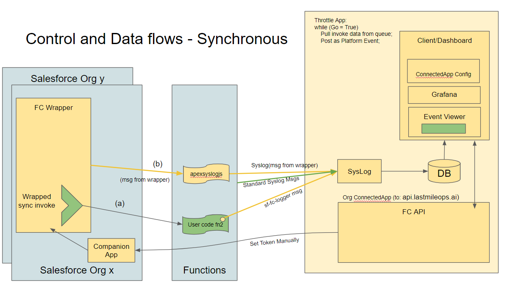
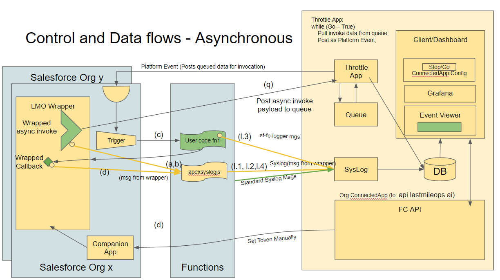

# **Functions Companion Overview**

[functionscompanion.github.io](https://functionscompanion.github.io/)

---

# Functions Companion

Functions Companion is an observability, performance and cost management solution for Salesforce Functions. It consists of a Lightning App that gets installed into your org, along with a logging library that the developer uses to instrument their functions source code. 

The Lightning App includes Apex Classes that the developer uses to 'wrap' their function invocations to gather operational and performance data. Functions Companion also includes an invocation queue and throttle mechanism that enables rate control for asynchronous functions. Data is forwarded to the (external) Functions Companion log processing platform for display in the Functions Companion Lightning Dashboards.

---
# Synchronous Invocations

* Sync point 1
* Sync point 2

---

# Asynchronous Invocations

* Async point 1
* Async point 2

